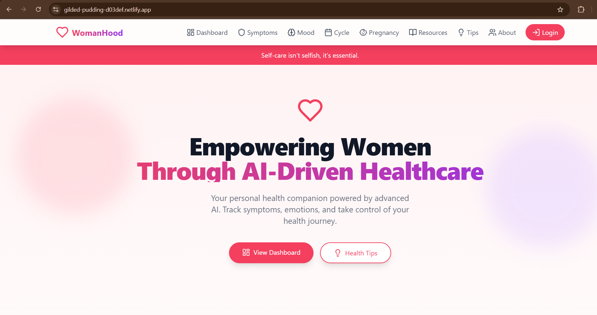

###  **🩺 WomanHood – Empowering Women Through AI-Driven Healthcare**

**Wellness is a journey, not a destination.**

### 🔗 **Live Website**: [https://gilded-pudding-d03def.netlify.app/](https://gilded-pudding-d03def.netlify.app/)

## **🌸 Description**
WomanHood is a responsive, user-friendly web application dedicated to supporting women’s health through the power of AI-driven tools. It acts as a personal health companion — allowing users to track symptoms, mood, cycle, and pregnancy, while also receiving personalized health tips and resources powered by Gemini 2.5 Flash AI.

Whether you're navigating menstrual health, emotional well-being, or pregnancy — WomanHood provides a safe, supportive, and tech-driven space.
---------------------------------------------------------------------------------------------------------------------------------------------------------------------------------------------------------------------
## **🚀 Features**
- 💬 AI-Powered Responses via Gemini 2.5 Flash

- 🧠 Mood Tracking & Cycle Monitoring

- 📅 Pregnancy Tracker & Health Dashboard

- 📚 Dynamic Tips & Resources Section

- ⚡ Dynamic rotating messages for better UX

- 🔐 Login-enabled access to personal health info

- 📱 Responsive and modern UI (built on bolt.new)

- ☁️ Deployed on Netlify
---------------------------------------------------------------------------------------------------------------------------------------------------------------------------------------------------------------------
## ⚙️ Built With

- 🌐 **Bolt.new** – Low-code builder used for fast development
- 💬 **Gemini 2.5 Flash API** – For AI-powered health chatbot
- 🎨 **HTML, CSS, JavaScript** – Custom enhancements
- ☁️ **Netlify** – Hosting and deployment

## 🗂️ Project Structure

```plaintext
WomanHood/
├── .bolt/                # Bolt project metadata
├── src/                  # Source files and components
│
├── index.html            # Main HTML entry point
├── README.md             # Project documentation (this file)
├── .env                  # Environment variables
├── .gitignore            # Git ignored files
│
├── package.json          # Project dependencies
├── package-lock.json     # Dependency lock file
├── tailwind.config.js    # Tailwind CSS configuration
├── postcss.config.js     # PostCSS config for Tailwind
├── vite.config.ts        # Vite build configuration
├── tsconfig.json         # TypeScript config
├── tsconfig.app.json     # App-specific TS config
└── tsconfig.node.json    # Node-related TS config
```

## 🌐 Website Preview

### 🏠 Homepage


### 💊 Symptom Tracker
  
*"Track your physical symptoms and monitor changes during cycles or pregnancy."*

### 🤰 Pregnancy Tracker
  
*"Monitor key milestones and health throughout your pregnancy journey."*

### 🩸 Menstrual Cycle Tracker
  
*"Visualize and track your menstrual cycle with easy-to-understand data."*

### 📚 Resources Page
  
*"Educational materials and health-related links at your fingertips."*

### 💡 Tips Page
  
*"Curated wellness tips for mental, hormonal, and reproductive health."*

### 🔐 Login Page
  
*"Simple and secure login to access personalized tracking features."*

## 🚀 Getting Started Locally

To run this project locally:
```bash
- git clone https://github.com/Umme-2003/WomanHood.git
- cd WomanHood
- Open index.html in your browser, or use Live Server if using VS Code.
```


